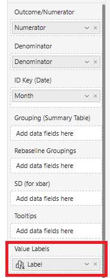
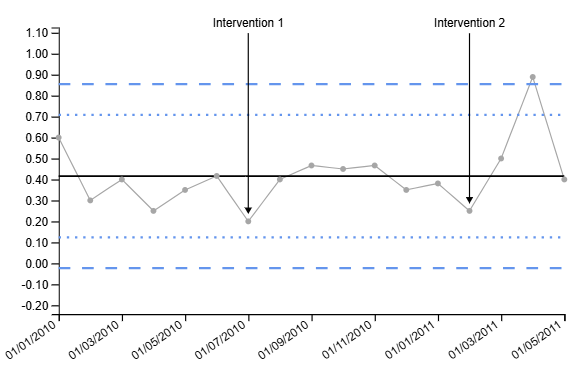

# Labelling Points on the SPC Chart

In some situations, it may be desirable to label particular points on the SPC chart. For example, if a point is identified as an outlier, it may be useful to label that point with additional information (e.g. the value of the point, or the reason for the outlier).

The SPC visual provides a simple way to label points on the chart, using the `Value Labels` input field. By providing a column in the data that contains the labels for each point, the labels will be displayed on the chart. To label only particular points, simply provide a blank value or empty string for points that should not be labelled.

For example, consider the following columns of data:

| Month      | Denominator | Numerator | Label          |
| ---------- | ----------- | --------- | -------------- |
| 01/01/2010 | 5           | 3         |                |
| 01/02/2010 | 20          | 6         |                |
| 01/03/2010 | 10          | 4         |                |
| 01/04/2010 | 20          | 5         |                |
| 01/05/2010 | 20          | 7         |                |
| 01/06/2010 | 12          | 5         |                |
| 01/07/2010 | 20          | 4         | Intervention 1 |
| 01/08/2010 | 20          | 8         |                |
| 01/09/2010 | 15          | 7         |                |
| 01/10/2010 | 20          | 9         |                |
| 01/11/2010 | 15          | 7         |                |
| 01/12/2010 | 20          | 7         |                |
| 01/01/2011 | 21          | 8         |                |
| 01/02/2011 | 20          | 5         | Intervention 2 |
| 01/03/2011 | 20          | 10        |                |
| 01/04/2011 | 9           | 8         |                |
| 01/05/2011 | 20          | 8         |                |

By adding the `Label` column to the `Value Labels` input field:

The labels will be displayed on the chart for the corresponding points:

