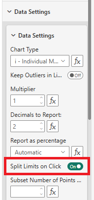
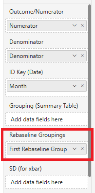
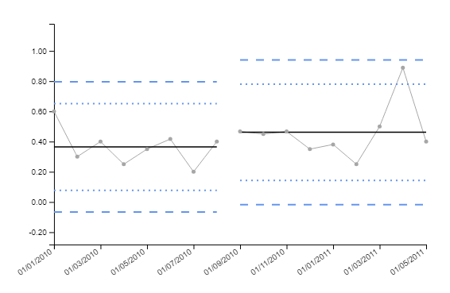

# Rebaselining Control Limits

In some situations, it may be desirable to rebaseline the control limits at a particular point in time. For example, if a process improvement has been made, it may be desirable to recalculate the control limits based only on data after the improvement was made.

The SPC visual provides two methods for rebaselining control limits:
1. **Split Limits on Click**: This option allows the user to click on a particular data point in the chart, and the control limits will be recalculated based only on data after that point. This is useful for ad-hoc rebaselining during data exploration.
2. **Rebaseline Groupings**: By providing a column in the data that indicates different baselining periods, the control limits can be automatically recalculated for each period. This is useful for regular rebaselining based on known process changes.

## Split Limits on Click

To enable this feature, simply toggle the `Split Limits on Click` option in the `Data Settings` menu. Once enabled, clicking on a data point in the chart will recalculate the control limits based on data after that point:

Be sure to toggle the option off again once you are finished rebaselining, otherwise the limits will continue to be rebaselined on each click.

## Rebaseline Groupings

While you can use the 'Split Limits on Click' option to manually/interactively rebaseline control limits, you might know in advance where you want to split the amounts - or to do this dynamically.

To do this, simply provide an argument to the 'Rebaseline Groupings' input field which indicates, for each observation, how to group them when calculating the control limits.

For example, consider the following columns of data:

| Month      | Numerator | Denominator | Rebaseline Group |
| ---------- | --------- | ----------- | ---------------- |
| 01/01/2010 | 3         | 5           | A                |
| 01/02/2010 | 6         | 20          | A                |
| 01/03/2010 | 4         | 10          | A                |
| 01/04/2010 | 5         | 20          | A                |
| 01/05/2010 | 7         | 20          | A                |
| 01/06/2010 | 5         | 12          | A                |
| 01/07/2010 | 4         | 20          | A                |
| 01/08/2010 | 8         | 20          | A                |
| 01/09/2010 | 7         | 15          | B                |
| 01/10/2010 | 9         | 20          | B                |
| 01/11/2010 | 7         | 15          | B                |
| 01/12/2010 | 7         | 20          | B                |
| 01/01/2011 | 8         | 21          | B                |
| 01/02/2011 | 5         | 20          | B                |
| 01/03/2011 | 10        | 20          | B                |
| 01/04/2011 | 8         | 9           | B                |
| 01/05/2011 | 8         | 20          | B                |

By adding the `Rebaseline Group` column to the `Rebaseline Groupings` input field:

The control limits will be calculated separately for each group:

Note that it is not important what value you use for this grouping (this example uses "A" and "B", but you could use any values), control limits will simply be grouped by the unique values in the `Rebaseline Group` column.
